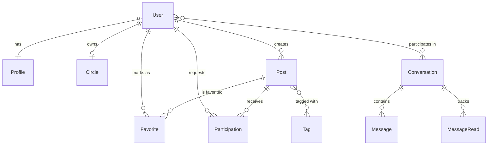

# データベース仕様書

## 概要
本プロジェクト（okadainsta）は、サークルやイベントの募集、参加、メッセージやり取りを行うプラットフォームです。
Djangoの標準認証ユーザー（User）をベースに、プロフィールやサークル情報、投稿、メッセージなどのテーブルで構成されています。

## テーブル一覧

| テーブル名 | モデル名 | 説明 |
| :--- | :--- | :--- |
| `core_profile` | `Profile` | ユーザーのプロフィール情報（学年、役割、自己紹介など） |
| `core_circle` | `Circle` | サークルの基本情報（サークル主の User に紐付け） |
| `core_tag` | `Tag` | 投稿に紐付けるタグ |
| `core_post` | `Post` | 募集投稿（スポーツ、音楽などのカテゴリー、期限など） |
| `core_favorite` | `Favorite` | 投稿へのお気に入り登録（User × Post） |
| `core_participation` | `Participation` | 投稿への参加申請とそのステータス（申請中、承認など） |
| `core_conversation` | `Conversation` | ダイレクトメッセージ（DM）またはグループチャットの枠組み |
| `core_message` | `Message` | 個別のメッセージ内容 |
| `core_messageread` | `MessageRead` | 各ユーザーの最終既読日時（既読管理用） |
| `core_notification` | `Notification` | システム内通知（お気に入り、参加申請、メッセージなど） |
| `core_postview` | `PostView` | 投稿の閲覧履歴（アクセスログ） |

---

## 各テーブル詳細

### 1. Profile (コア・プロフィール)
ユーザーの追加情報を保持します。Django標準 User と 1:1 で紐付きます。

| フィールド名 | 型 | 説明 |
| :--- | :--- | :--- |
| `user` | OneToOne(User) | ユーザー本体 |
| `display_name` | Char(50) | 表示名 |
| `school_year` | Char(100) | 学年 |
| `role` | Char(100) | 役割 |
| `bio` | Text | 自己紹介 |
| `avatar` | Image | アイコン画像 |
| `stats_posts` | PositiveInt | 投稿数（統計用） |
| `stats_favs` | PositiveInt | 総お気に入り数（統計用） |
| `stats_msgs` | PositiveInt | 送信メッセージ数（統計用） |

### 2. Post (募集投稿)
サークルやイベントの募集記事です。

| フィールド名 | 型 | 説明 |
| :--- | :--- | :--- |
| `author` | ForeignKey(User) | 投稿者 |
| `title` | Char(120) | タイトル |
| `circle_name` | Char(80) | サークル名 |
| `place` | Char(120) | 活動場所 |
| `detail` | Text | 詳細内容 |
| `event_at` | DateTime | 開催日時 |
| `image` | Image | 投稿画像 |
| `status` | Char(10) | 状態（募集中、終了） |
| `category` | Char(20) | カテゴリー（スポーツ、音楽など） |
| `tags` | ManyToMany(Tag) | 関連タグ |
| `created_at` | DateTime | 作成日時 |

### 3. Participation (参加申請)
投稿に対するユーザーの参加状況を管理します。

| フィールド名 | 型 | 説明 |
| :--- | :--- | :--- |
| `post` | ForeignKey(Post) | 対象の投稿 |
| `user` | ForeignKey(User) | 参加希望ユーザー |
| `status` | Char(10) | ステータス（申請中、承認、却下、キャンセル） |
| `created_at` | DateTime | 申請日時 |

### 4. Conversation & Message (チャット機能)
ユーザー間のコミュニケーション用です。

**Conversation**
- `title`: タイトル（グループ名など）
- `participants`: 参加ユーザー一覧（ManyToMany）
- `is_group`: グループかDMかのフラグ
- `post`: 関連する投稿（任意）

**Message**
- `conversation`: 属する会話
- `sender`: 送信者
- `body`: メッセージ本文
- `created_at`: 送信日時

---

## リレーション図（簡易）

